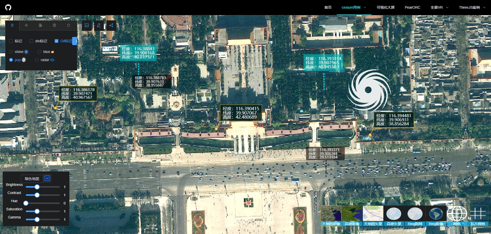

# demo-collection

[](LICENSE)


[](https://github.com/whanxueyu/demo-collection/stargazers)
[](https://github.com/whanxueyu/demo-collection/network/members)

## 项目介绍

这是一个在业余时间创建的示例集合项目，包含多种视觉效果如CSS与SVG特效，包括霓虹风格按钮、赛博朋克元素等。此外，还实现了360度全景展示和VR页面浏览功能，并且有一个简单的VR看房应用。项目还包括了`cesium`相关的很多案例和组件、数据可视化大屏模板以及其他实验性内容。如果你觉得这些内容对你有所帮助，请给予一个Star。

此外，我还在开发一个Vue组件库——[CyberPunk-UI](https://github.com/whanxueyu/cyberpunk-ui)，欢迎提交 ``issue`` 和 ``pr``。


---

### GitHub仓库
- [GitHub](https://github.com/whanxueyu/demo-collection.git)

### Gitee仓库
- [Gitee](https://gitee.com/whaxy/demo-collection.git)

### 在线预览
- [在线演示](https://axydemo.netlify.app/)

---

## 快速开始

### 克隆项目
```bash
git clone https://github.com/whanxueyu/demo-collection.git
```
推荐使用 ```pnpm``` 作为依赖管理工具

### 安装pnpm
```bash
npm install pnpm -g
```

### 安装依赖

```bash
pnpm install
```

### 开发环境编译启动热更新
```bash
pnpm run serve
```

### 生产环境打包
```bash
pnpm run build
```

## 展示截图

```魔术文字和3D立体进度条```


```3D轮播图和js打字效果```


```可视化大屏模板```


```纯前端ORC文字识别```


```各种方式实现的VR看房```


### threejs

```粒子波浪效果```


```threejs的太空背景登录页模板```


### cesium

``` div标签，vue组件标签，gif标签 ```



``` 模型队列计算和队形转换效果，模型拖拽添加，编辑位置缩放旋转工具 ```


``` 结合Echarts实现迁徙线效果及饼图加载 ```


``` 计算赛贝尔曲线生成迁徙线效果 ```


```视频材质、雷达、动态墙、动态线、雷达扫描、电弧球体、粒子效果和暗色地图图层编辑```


## 展示截图

### 特效与界面

- **魔术文字和3D立体进度条**
  

- **3D轮播图和JS打字效果**
  

- **可视化大屏模板**
  

- **纯前端OCR文字识别**
  

- **各种方式实现的VR看房**
  

### Three.js

- **粒子波浪效果**
  

- **太空背景登录页模板**
  

### Cesium

- **div标签、vue组件标签、gif标签等各类标签展示**
  

- **模型队列计算和队形转换效果，模型拖拽添加，位置修改、缩放、旋转编辑工具**
  

- **结合Echarts实现迁徙线效果及饼图加载**
  

- **计算赛贝尔曲线生成迁徙线效果**
  

- **视频材质、雷达、动态墙、动态线、雷达扫描、电弧球体、粒子效果和暗色地图图层编辑**
  